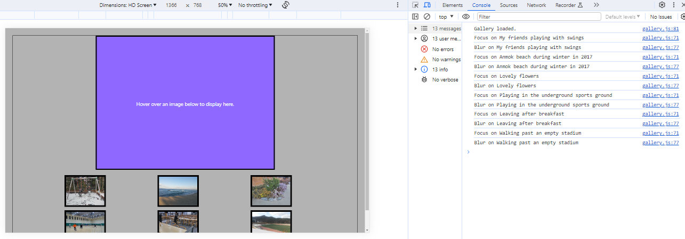
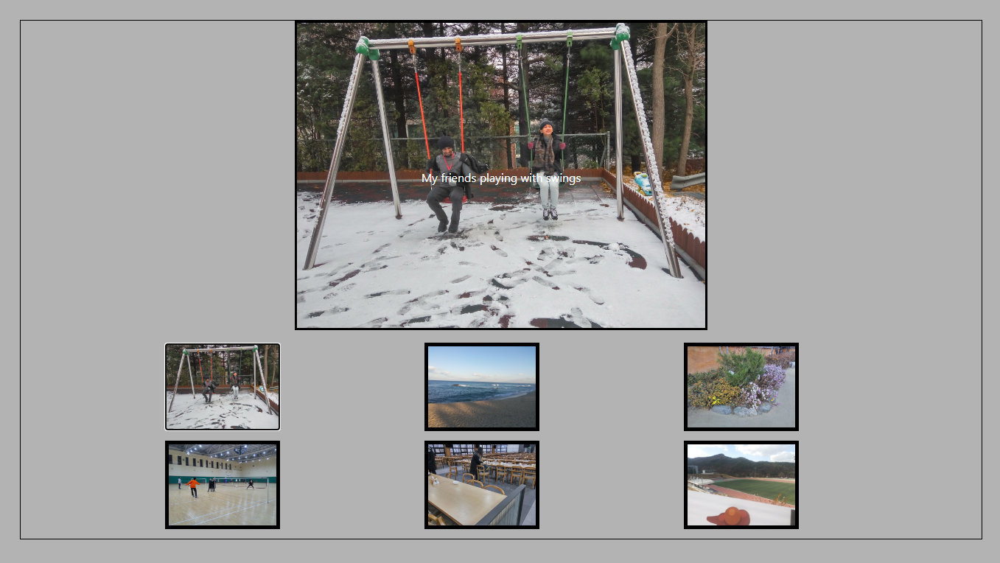
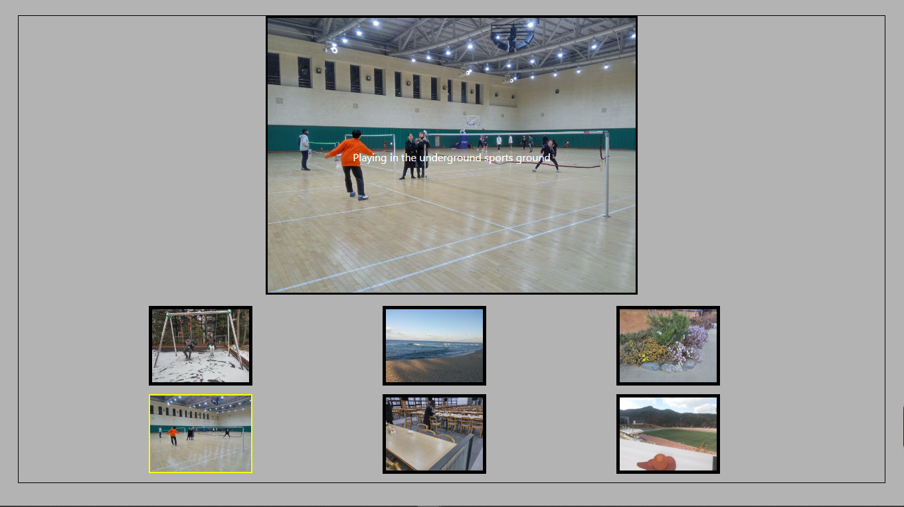

# Js-Interactivity
Final project of Interactivity with JavaScript from Michigan University on Coursera
 
 
<strong>Final Project Description</strong>
Instructions
1. Use the code from the <a href="https://codepen.io/ColleenEMc/pen/wKYxZa">Interactive Photo Gallery</a> as your starting point.
2. Update the code to use six images of your choice, making sure to include alternative text for each.
3. Validate your site on <a href="https://validator.w3.org/">The W3C Markup Validation Service</a>.
4. Validate your site using the <a href="https://wave.webaim.org/"> Wave</a> validator site or browser extension.
5. Validate your site using the <a href="https://www.deque.com/axe/?branded=&utm_term=axe%20tool&utm_campaign=Search+-+axe+Pro+-+Branded&utm_source=adwords&utm_medium=ppc&hsa_src=g&hsa_ad=431336436914&hsa_tgt=kwd-869514794839&hsa_mt=e&hsa_ver=3&hsa_acc=7854167720&hsa_kw=axe%20tool&hsa_grp=108623642548&hsa_cam=6769485255&hsa_net=adwords&gclid=Cj0KCQjw4bipBhCyARIsAFsieCwjP8X1-rKNBmI0Baf1mdqBFGK9yyeaxzh4gd2NXK2juuyxxiqn6vQaAtHJEALw_wcB">aXe</a> browser extension.
6. Add the listeners for onfocus Event and onblur Event using the same pattern I gave you for the  onmouseover Event and onmouseleave Event.  (Don't delete those events though!)
7. Test your site's functionality for mouse movement.
8. Add the listener for onload – deciding what you want to call the new function.
9. Add the new function for adding the tabfocus attribute
    a. Add a console.log message to make sure that your event triggers
    b. Write a for loop to loop through each image
    c. Add the tabindex attributes 
10. Test your site's functionality for keyboard access.
11. Host and share your site
12. Complete your peer reviews.
The javascript functions in the project modifies the HTML content to show the galleries of pictures contained in an array.
 
 
The idea of the site is to enrich HTML page with Javacript functionalities, particularly using onload, onFocus, and onBlur besides onmouseover and onmouseleave to add accessibility to users with keyboards. 
<ul>
  <li>When mouse hover on the preview image, it will be displayed on the designated element, then when mouse leave the preview the element goes back to its default view.</li>
  <li>Similarly, when keyboard is used to navigate the page, onFocus will display the image, then onBlur change the view to default as well.</li> 
<ul>
I hosted this site on AWS Amazon S3 when submitting, and here are the demo of the site when it was online: 
1. Console logs of the functions and the default view of the page:
 
2. onmouseover functionality: 
 
3. onFocus functionality: 

